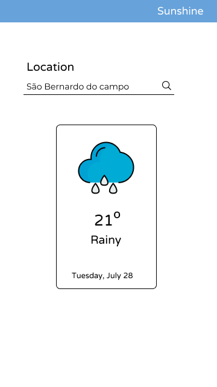

<h1 align="center"></h1>

### ☀️ What is Sunshine? 

Sunshine is a **weather app** for **IOS** and **Android**. You can search any city in the world and the app will fetch it's current temperature (in Celsius) and weather. 

### 🌈 Design of Sunshine

The design was made on Figma and the idea was to be really colorful and pleasant, with really smooth icons and shapes.

### ⚡ How it was made?

Sunshine was made entirely in React Native usign **Expo** and integrated with the <a href="https://openweathermap.org/">**Open Weather Map**</a> API. I used some componentzation (React biggest strength) to conditionally render
the weather card and it's corresponding icon. I also used the <a href="https://github.com/expo/google-fonts">**Expo-google-fonts library**</a> to add the custom fonts to the project.

### 🌩️ The Open Weather Map API

I tried using some other weather APIs but, for sure, Open Weather Map was the best to work with. JSON data was simple to search through and find the info i wanted. The documentation
is a bit lacking but, overall, it's a really solid API.

### 🌧️ Cloning Sunshine

You can clone this repository using 

``git clone https://github.com/mateusrizzo/sunshine.git``

### 🌥️ Expo
But you need to have <a href="http://expo.io">Expo CLI</a> in your computer to run this project in a development server. Expo documentation is really good and is easy to find what you need there.

To install Expo CLI, just install it like this on your favorite package manager

``npm install -g expo-cli``

This command will install Expo globally in your computer and you can use it to handle your React Native projects more easily.

You can also install **Expo Client** on your cellphone so you can test the application as you code it.

### ❄️ APK

In case you want the APK and test it on your android device or emulator, you can download it right <a href="https://drive.google.com/file/d/1qs5rHn0zVKZEpApqt7sM-UUY8zYj6-en/view?usp=sharing">here</a>

 with 💜 Mateus Rizzo 

